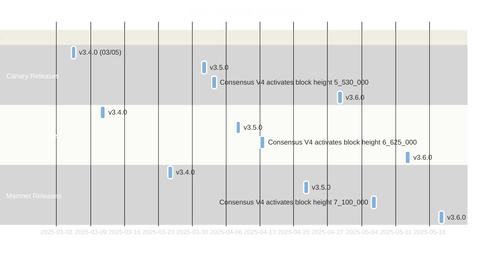

```mermaid
%%{init: {"theme": "dark", "themeVariables": {"ganttTextFill": "#FFFFFF", "ganttBarHeight": 18, "ganttBarProgressionColor": "#ff6f61"}}}%%
gantt
    title Aleo Release Schedule
    dateFormat  YYYY-MM-DD
    tickInterval 1week
    section -
    - : 02/28/2025,

    section Canary Releases
    v3.4.0 (03/05) :active, 03/05/2025, 1d
    v3.5.0 :active, c2, 04/01/2025, 1d
    Consensus V4 activates block height 5_530_000:active, 04/03/2025, 1d
    v3.6.0 :active, c2, 4/29/2025, 1d
    
    section Testnet Releases
    v3.4.0 :active, t1, 03/11/2025, 1d
    v3.5.0 :active, t2, 04/08/2025, 1d
    Consensus V4 activates block height 6_625_000:active, t3, 04/13/2025, 1d
    v3.6.0 :active, c2, 5/13/2025, 1d
    
    section Mainnet Releases
    v3.4.0 :active, m1, 03/25/2025, 1d
    v3.5.0 :active, m2, 04/22/2025, 1d
    Consensus V4 activates block height 7_100_000:active, m3, 05/06/2025, 1d
    v3.6.0 :active, c2, 5/20/2025, 1d
```
